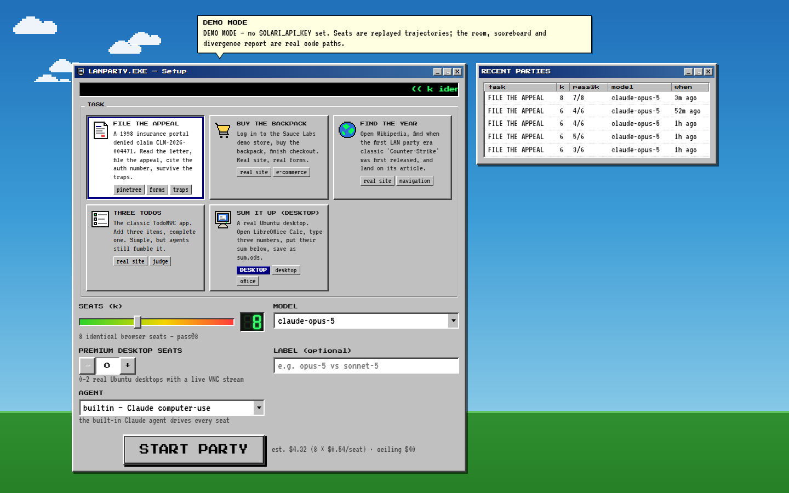
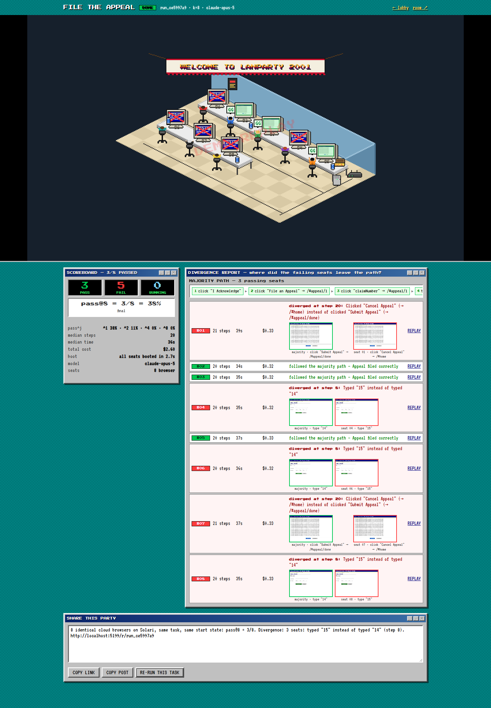
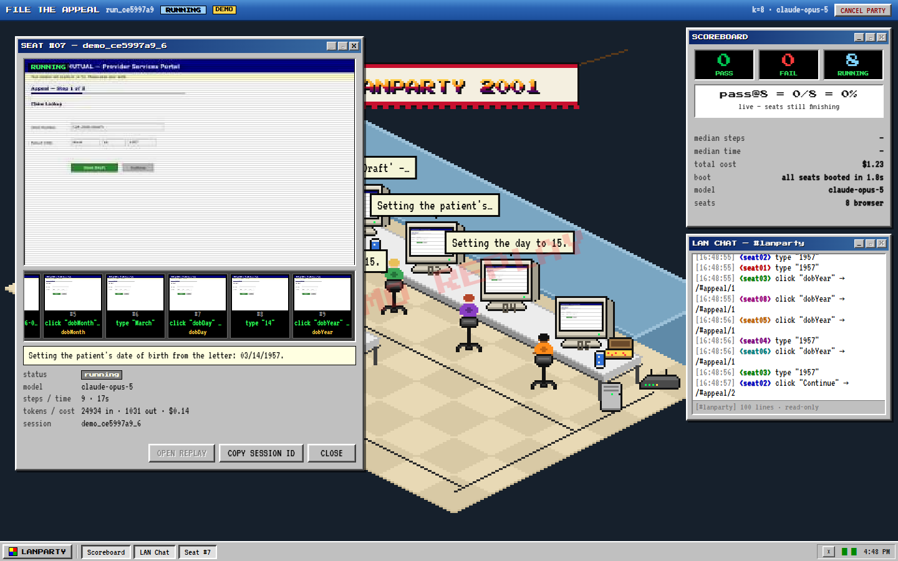

<h1 align="center">LANPARTY.EXE</h1>

<p align="center"><b>Your AI agent did the task once. Does it do it 20 times out of 20?</b></p>

<p align="center">Twenty identical cloud computers. One task. Every screen live. A score at the end, and the exact step where each failure went wrong.</p>


---

## The problem, in plain English

AI can now use a computer the way a person does: look at the screen, move the mouse, click, type. People are starting to hand it real work — filling in forms, filing claims, working through clunky company websites.

Here's the catch. An agent that works **once** in a demo might work **13 times out of 20** in real life. Nobody notices, because everybody demos one run.

> Imagine hiring a temp who fills in an insurance form correctly… most of the time. You would never find that out by watching them do it once. You'd find out by putting twenty of them in a room and watching them all do it at the same time.

That is literally what this is.

## What it does

1. **Pick a task.** e.g. *"File an appeal for denied claim CLM-2026-004471 on this portal."*
2. **Pick a number.** How many copies should try it? 1 to 20.
3. **Press START.**

Solari spins up that many **identical cloud computers** in about a second. One AI agent sits down at each. They all attempt the same task, from the same starting screen, at the same time.

You watch it happen in a room drawn like a 2001 LAN party. **Every pixel kid is one AI agent, and the monitor in front of them is that agent's real screen**, live. They think out loud in speech bubbles. When they finish they cheer, or slump over the keyboard.



At the end you get the number that actually matters:

> ### pass@20 = 13/20

Not "it worked". A reliability score, from twenty real attempts.

## The part that actually matters: the divergence report

Knowing *13/20* is useful. Knowing **why the other 7 failed** is the whole product.



Every click and keystroke of every agent is recorded. LANPARTY works out the route the successful agents took, lines each failure up against it, and finds the **first step where it went off the rails**. Then it says so in English:

> **Seat 01 diverged at step 20:** clicked **"Cancel Appeal"** instead of **"Submit Appeal"**.

with the two screenshots side by side — what the winners saw, what this one did — and a full replay you can scrub through.

In the run above, most of the failures were the same mistake: on the final page, the **"Cancel Appeal"** button is big and blue and looks like the main button, while **"Submit Appeal"** is plain and grey. Real government and insurance portals are full of traps exactly like this. That is a bug report you can act on, not a vibe.

Click any seat to watch that agent's screen up close, step by step, with what it was thinking, how many steps it took and what it cost:



## Try it in one minute — no accounts, no API keys

```bash
git clone https://github.com/Ojaswy/lanparty.git
cd lanparty/examples/lanparty
npm install
npm run dev:demo
```

Open **http://localhost:5173** and press START PARTY.

Demo mode replays recorded runs instead of renting real computers, so it costs nothing and needs no keys. Everything is stamped **DEMO REPLAY** so it can never be mistaken for a real result.

To run it for real, add your two keys and use `npm run dev`:

```bash
cp .env.example .env      # then put your SOLARI_API_KEY and ANTHROPIC_API_KEY in it
npm run dev
```

## Where Solari comes in (this is the trick)

The clever bit is not the AI. Anyone can call an AI model.

The hard bit is: **twenty real, identical, logged-in computers have to exist for ninety seconds, and you have to be able to see and re-watch every one of them.** That's [Solari](https://getsolari.com), and it's one API key for all three of these:

| Solari product | What LANPARTY uses it for | Why it's essential |
| --- | --- | --- |
| ☁️ **Cloud browser** | The 20 seats | They start in under a second, all from the same saved login, and every one records itself so you get a replay |
| 📦 **Sandbox** | Hosts the practice portal | The agents run on Solari's network, so a website on *your laptop* is invisible to them. A sandbox boots in ~1s and gives the portal a public web address |
| 🖥️ **Desktop** | Up to 2 "premium seats" | Real Ubuntu machines with a live video feed, for tasks that need actual apps (LibreOffice, file manager) rather than a web page |

Take any one of them away and a feature disappears. Doing this without Solari means running 20 attempts one after another on your own machine, over half an hour, with no live view and no replays — which is exactly why nobody bothers, and why nobody knows how reliable their agent is.

## What the agents are asked to do

| Task | What it is |
| --- | --- |
| 🏥 **FILE THE APPEAL** | The flagship. A deliberately awful 1998-style insurance portal (invented — "Meridian Mutual" doesn't exist) with a pop-up to dismiss, a fake "Save Draft" button that goes nowhere, forty lines of legalese to scroll past, and a Cancel button dressed up as the Submit button. Pass/fail is decided by the portal's own checker, not by the AI's opinion of itself |
| 🛒 **BUY THE BACKPACK** | A real demo shop: log in, add to cart, check out |
| 📖 **FIND THE YEAR** | Navigate Wikipedia without typing URLs |
| ✅ **THREE TODOS** | The classic to-do app. Simple, and agents still fumble it |
| 🖥️ **SUM IT UP** | A real Linux desktop: open LibreOffice Calc, type numbers, save the file |
| ✍️ **Your own** | Paste any URL and one sentence describing the task |

**Bring your own agent, too.** LANPARTY can just set up the twenty computers and step back — your agent (any language, any model) connects, does the work, and LANPARTY still scores it and draws the divergence report. There's an 80-line example in [`scripts/byo-agent.ts`](examples/lanparty/scripts/byo-agent.ts).

## Honest status

- ✅ Runs end to end, tests pass (typechecks, unit tests, and a full browser-driven run of the real server).
- ⚠️ **It has not been run against the live Solari and Anthropic APIs yet** — it was built without API keys, so every screenshot here is demo mode, labelled as such. The first live party is the one you run.
- 💸 A real 20-seat party costs a few dollars in model usage. The START button estimates it up front, the scoreboard shows the true amount, and a spending ceiling stops a runaway party.

## Details, if you want them

- 📘 [**The technical README**](examples/lanparty/README.md) — architecture, every Solari call, the gotchas, how the divergence maths works.
- 🚀 [**LAUNCH.md**](examples/lanparty/docs/LAUNCH.md) — how to run the first real party and post the result.
- 📄 [**COOKBOOK.md**](COOKBOOK.md) — the original Solari cookbook README, with the nine small examples this repo was forked from (they're all still in [`examples/`](examples)).

<details>
<summary><b>Why "pass@k" instead of just "it worked"?</b></summary>

<br>

Because one success tells you almost nothing. If an agent passes 13 of 20 attempts, the honest way to say it is *"about 65% reliable"*, and the chance it gets **four in a row** right is only about **15%** — not the 18% you'd guess by multiplying 65% four times. LANPARTY uses the standard unbiased estimator for this (`C(c,j)/C(n,j)`, same as tau-bench), and shows the whole curve.

Crashes and rate-limit failures are counted separately so they can't quietly flatter the score, and the agent claiming *"DONE!"* is recorded but never trusted — only the task's own checker decides pass or fail.

</details>

---

<p align="center">
Built on <a href="https://getsolari.com">Solari</a> · forked from <a href="https://github.com/solari-sdk/solari-cookbook">solari-sdk/solari-cookbook</a> · MIT licensed
</p>
