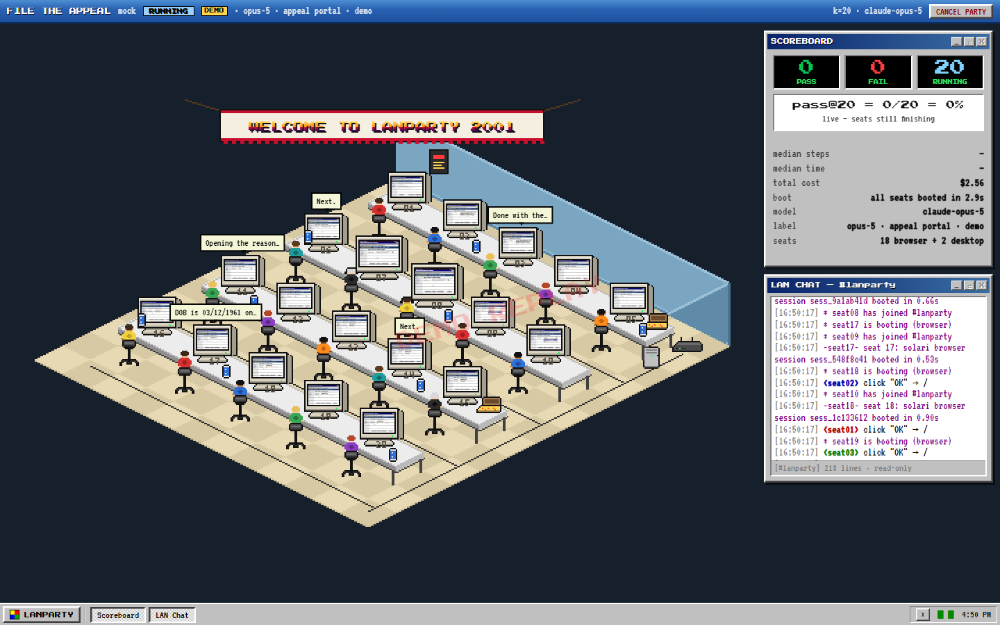

# LANPARTY.EXE

> **Your computer-use agent worked once. Run it 20 times at once and find out if it's actually reliable.**

LANPARTY.EXE is a **pass@k reliability harness for computer-use agents**, built on
[Solari](https://getsolari.com) and dressed as a 2001 LAN party. Pick a task, pick `k`,
press START. Solari forks `k` identical cloud browsers (plus up to two real Ubuntu
desktops as "premium seats"), a computer-use agent sits down at each, and you watch every
screen live in an isometric pixel-art room. When the party's over you get:

- **pass@k** — a reliability number, not a lucky demo (`13/20`), plus the **pass^k curve**
  (the unbiased tau-bench estimator, `C(c,j)/C(n,j)`, for j = 1, 2, 4, 8)
- **median steps, median time, real cost from token usage, boot time** for the fleet
- a **Divergence Report** — for each failing seat, the first step where it left the path
  the passing majority took: *"Clicked 'Cancel Appeal' instead of 'Submit Appeal' at step 20"*
- an **in-app replay per seat** (Solari's rrweb recording, persisted; desktop mp4s too)
- a **shareable result page** whose social card is the scoreboard

Reliability is what "agents as labor" actually requires. Most agent demos show one run.
This shows twenty, side by side, on byte-identical machines, and tells you why the ones
that failed failed.



## What Solari does here (and why it's load-bearing)

| Solari product | Used for | Why it matters |
| --- | --- | --- |
| **Cloud browser** (`@solarisdk/browser`) | one seat per run, `k` at a time | sub-second launches, Playwright API, `page.screencast` for the live CRTs, `recording: true` gives every seat an rrweb replay, `profileId` gives every seat the same logged-in start state |
| **Sandbox** (`@solarisdk/sdk`) | hosts the built-in **insurance denial-appeal portal** | the seats run on Solari's network, so a portal on your laptop is unreachable; a sandbox boots in ~1s, we write the portal in, `previewUrl()` makes it public for both seats and the grader |
| **Desktop** (`@solarisdk/desktop`) | "premium seats": real Ubuntu GUIs | live VNC stream (relayed view-only by the server, mounted with noVNC), `record.start()` for an mp4, the same computer-use action API for the agent |

One `slr_live_` key for all three. Nothing here is decorative: remove any of them and a
feature disappears.

## The flagship task: FILE THE APPEAL

A 1998-style insurance provider portal (*Meridian Mutual — Provider Services Portal*)
shows a denial letter for claim `CLM-2026-004471`, reason `CO-197 precertification absent`,
with a provider note that the authorization *was* obtained (`PA-88213`). The agent has to
dismiss a notice, start the appeal, enter the claim number and DOB exactly, choose the
right reason, cite the auth number, attest, scroll past forty lines of legalese, and press
the plain gray **Submit Appeal** button, not the bold blue **Cancel Appeal** next to it,
and not the big green **Save Draft** two pages earlier.

Every seat gets its own key (`?seat=run_x-7`); the portal's `/state/<seat>` endpoint is
the grader and explains the first rule that failed. Pass/fail is deterministic. The agent
saying "DONE" is recorded as a claim, never trusted. The traps are frozen in
[`server/portal/README.md`](server/portal/README.md); nothing is tuned between runs, and
whatever number comes out is the number.

This is the shape of the real work computer-use agents are being hired for. It is also
where they break.

Other built-in tasks: a real e-commerce checkout (saucedemo), Wikipedia navigation,
TodoMVC (LLM-judged), and a LibreOffice Calc task on a real desktop. Custom tasks are a
URL + an instruction + a success check.

## Run it

```bash
cd examples/lanparty
npm install
cp .env.example .env    # add SOLARI_API_KEY and ANTHROPIC_API_KEY
npm run dev             # server :8787 + web :5173
```

No keys? `npm run dev:demo` runs the whole thing with **replayed seats**: same room, same
scoreboard, same divergence report, stamped DEMO REPLAY everywhere. Demo seats have no
Solari session behind them, so they have no replay; nothing in demo mode is presented as
a real result.

Production: `npm run build && npm start` serves the built client from `dist/` with OG tags
on result pages. Set `PUBLIC_URL` so share links and the social card are absolute. The
server needs a persistent `data/` directory (runs, replays, recordings are files).

`npm test` = typecheck + unit checks (estimator, divergence alignment, VNC input filter)
+ an end-to-end demo-mode party against a throwaway server.

### Cost, honestly

Twenty parallel vision loops are not free. The START button shows an estimate per seat
for the selected model (from token math, not vibes), the scoreboard shows the real number
from `usage`, and `LANPARTY_COST_CEILING_USD` (default $40) stops a party that runs away.
Ballpark for the appeal task (~20 steps): roughly **$0.30–0.50 per seat on
`claude-sonnet-5`, $0.80–1.20 on `claude-opus-5`**, with prompt caching and server-side
context editing doing most of the saving. Pick the model in the dropdown; opus is the
default because it is the better agent, not the cheaper one.

On Solari's side a 20-seat party is 20 short browser sessions plus one small sandbox for
the portal, which the server releases three minutes after the last party.

### "Now do GPT"

Set `OPENAI_API_KEY` (and optionally `OPENAI_BASE_URL`, `OPENAI_MODELS`) and any model name
not starting with `claude-` runs through an OpenAI-compatible chat-completions adapter
with the **same action vocabulary** on the **same machines**, so RE-RUN with another model
is an apples-to-apples comparison.

### Bring your own agent

`POST /api/runs` with `"agent": "external"` boots the seats and waits. `GET
/api/runs/:id/seats` hands you a CDP endpoint per seat; connect with anything
(`chromium.connectOverCDP`, Puppeteer, your own CUA), POST each step to
`.../seats/:n/steps` if you want it in the divergence report, and POST `.../seats/:n/done`
when you're finished. LANPARTY grades the seat with the task's success check and tears it
down. [`scripts/byo-agent.ts`](scripts/byo-agent.ts) is an 80-line reference client that
runs the saucedemo checkout with plain Playwright selectors. (Endpoints are loopback-wrapped
by the Solari SDK, so run your agent on the same host as the server.)

## How it works

```
POST /api/runs {task, k, model | agent:"external"}
   │
   ├─ (task needs the portal) sandbox.create → files.write(server.py, index.html)
   │                           → sh -c "nohup python3 server.py &" → previewUrl(8080)
   │
   └─ for each of k seats, staggered 250ms, 429s retried as "waiting for a slot":
        browser seat:  solari.launch({recording:true, profileId}) → page.goto(start)
                       page.screencast.start(onFrame → ws "seat:frame")
        desktop seat:  desktops.create({record:true}) → open("google-chrome", url)
                       streamUrl → server-side view-only RFB relay → noVNC in the client
        agent loop:    Claude computer_toolset_20260801 (or OpenAI-compat) ⇄ seat.act()
                       every action → Step{token, target, note, thumb} → ws "seat:step"
                       (model calls go through a concurrency gate; a wall clock and a
                        cost ceiling bound every seat)
        grade:         url_contains | text_present | selector | grader_endpoint | llm_judge
        teardown:      browser.close() / desktops.destroy() → download rrweb NDJSON / mp4
   │
   └─ summary (pass@k, pass^k curve, medians, cost, boot time) + divergence → /r/:id
```

**Divergence.** Each step is normalised to a token. For browser seats a click is
identified by the element under the cursor (`left[button:Submit Appeal]→/#appeal/done`),
which the seat records with `elementFromPoint` just before clicking, so pixel jitter
between seats compares equal and "Cancel" vs "Submit" doesn't. Desktop seats fall back
to a 10×10 screen grid. The majority path is the per-step plurality across passing seats
(cut off once a strict majority has finished); each failing seat is aligned to it with a
longest-common-subsequence so an extra scroll isn't "divergence"; the first unaligned step
is where it left the path. The label is *first split from the majority path*, never "the bug".

**Context.** Twenty parallel agents each dragging twenty screenshots along would be
expensive. The Claude loop uses server-side context editing (`clear_tool_uses_20250919`)
to drop old screenshots past 36k input tokens while keeping the last six tool uses, and
prompt caching on the stable prefix. Assistant turns are never rewritten client-side.

**Honesty.** A seat passes only if the success check passes. Seats that crash, get
rate-limited to death, or are cancelled are `error`, shown separately and excluded from
the pass rate's denominator. `DONE` from the model is recorded as *claimed*, next to the
verified verdict.

**Safety.** Desktop stream URLs are signed capabilities that grant input; the server
relays them through `/ws/stream/:run/:seat` and drops key/pointer/clipboard messages at
the RFB level, so a public result page can show a live desktop without handing out the
mouse. Solari's replay URLs are presigned and expire, so recordings are downloaded and
served from `data/`.

## Layout

```
server/            Node 22 + Express 5 + ws
  index.ts         HTTP API, websocket fan-out, VNC relay, static/OG serving
  runner.ts        fork → agents (or external) → grade → summarise → divergence → replays
  agent/           Claude computer-use loop, OpenAI-compatible loop, shared types
  seats/           BrowserSeat (Solari browser), DesktopSeat (Solari desktop)
  portal/          the insurance portal + PortalHost (Solari sandbox hosting)
  divergence.ts    tokens, majority path, LCS alignment, first divergence
  streamRelay.ts   view-only RFB relay
  demo.ts          replayed seats for DEMO MODE
  og.ts            the social card
web/               Vite + React 19; canvas isometric room, Win98 windows, noVNC, rrweb player
shared/            types + websocket protocol (the contract)
scripts/           smoke.mjs (e2e demo party), unit.ts, byo-agent.ts, og-preview.ts
```

## Gotchas learned the hard way (all encoded in the code)

- `recording: true` is per session. Without it the replay endpoint 404s forever, and the
  upload is async after release, so the server polls for it after teardown.
- `sessions.getReplayUrl()` is a presigned link to gzipped rrweb NDJSON, not a viewer.
  Download it, keep it, play it yourself.
- `await solari.close()` on shutdown or the Node process never exits.
- Sandbox commands aren't shell-interpreted; the portal server is started with
  `sh -c "nohup … &"` because `commands.run` waits for exit (with a `commands.start`
  fallback if the guest reaps the child).
- `destroy(sessionId)` ends a desktop; `close()` only drops your channel.
- `@solarisdk/desktop`'s `mountDesktop` imports `@novnc/novnc/lib/rfb.js`, which doesn't
  exist in noVNC 1.7; the client uses `@novnc/novnc/core/rfb.js` directly.
- The SDK doesn't retry 429 `ConcurrencyLimitExceeded`; the orchestrator does, as a
  "waiting for a slot" state, so a 20-seat party on a 3-browser plan runs in waves.
- Haiku 4.5 rejects adaptive thinking, `effort` and the fallback beta; it isn't in the
  dropdown for that reason.

## License

MIT, like the rest of the cookbook. The portal is fiction; Meridian Mutual does not exist.
